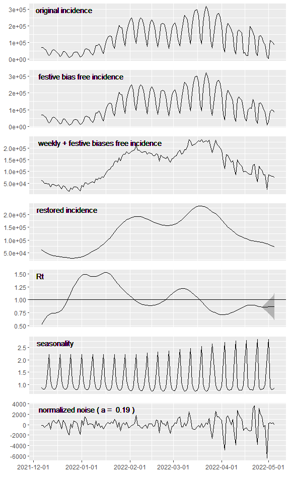

<!-- README.md is generated from README.Rmd. Please edit that file -->

### EpiInvert (version 0.3.1, December 2022)

<!-- badges: start -->
<!-- badges: end -->

Using variational techniques we address some epidemiological problems as
the incidence curve decomposition or the estimation of the functional
relationship between epidemiological indicators. We also propose a
learning method for the short time forecast of the trend incidence
curve.

#### Vignettes of the main package functionalities

- [`EpiInvert`](https://lalvarezmat.github.io/EpiInvert/EpiInvertVignette.html) :
  an incidence curve decomposition by inverting the renewal equation.

- [`EpiInvertForecast`](https://lalvarezmat.github.io/EpiInvert/EpiInvertForecastVignette.html)
  : a learning method for the short time forecast of the trend incidence
  curve.

- [`EpiIndicators`](https://lalvarezmat.github.io/EpiInvert/EpiIndicatorsVignette.html) :
  estimation of the delay and ratio between epidemiological indicators.

We also present in [Rt
Comparison](https://lalvarezmat.github.io/EpiInvert/RtComparisonVignette.html) a
comparative analysis of the methods : EpiInvert,
[EpiEstim](https://CRAN.R-project.org/package=EpiEstim),
[Wallinga-Teunis](https://academic.oup.com/aje/article/160/6/509/79472)
and [EpiNow2](https://CRAN.R-project.org/package=EpiNow2).

#### EpiInvert Installation

You can install the development version of EpiInvert from
[GitHub](https://github.com/) with:

``` r
 install.packages("devtools")
 devtools::install_github("lalvarezmat/EpiInvert")
```

#### Example

We attach some required packages

``` r
library(EpiInvert)
library(ggplot2)
library(dplyr)
library(grid)
```

Loading data on COVID-19 daily incidence up to 2022-05-05 for
[France](https://www.santepubliquefrance.fr/dossiers/coronavirus-covid-19/coronavirus-chiffres-cles-et-evolution-de-la-covid-19-en-france-et-dans-le-monde),
[Germany](https://experience.arcgis.com/experience/478220a4c454480e823b17327b2bf1d4),
[the USA](https://ourworldindata.org/coronavirus-source-data) and [the
UK](https://ourworldindata.org/coronavirus-source-data):

``` r
data(incidence)
tail(incidence)
#>           date   FRA    DEU    USA    UK
#> 828 2022-04-30 49482  11718  23349     0
#> 829 2022-05-01 36726   4032  16153     0
#> 830 2022-05-02  8737 113522  81644    32
#> 831 2022-05-03 67017 106631  61743 35518
#> 832 2022-05-04 47925  96167 114308 16924
#> 833 2022-05-05 44225  85073  72158 12460
```

Loading some festive days for the same countries:

``` r
data(festives)
head(festives)
#>          USA        DEU        FRA         UK
#> 1 2020-01-01 2020-01-01 2020-01-01 2020-01-01
#> 2 2020-01-20 2020-04-10 2020-04-10 2020-04-10
#> 3 2020-02-17 2020-04-13 2020-04-13 2020-04-13
#> 4 2020-05-25 2020-05-01 2020-05-01 2020-05-08
#> 5 2020-06-21 2020-05-21 2020-05-08 2020-05-25
#> 6 2020-07-03 2020-06-01 2020-05-21 2020-06-21
```

Executing EpiInvert using Germany data:

``` r
res <- EpiInvert(incidence$DEU,"2022-05-05",festives$DEU)
```

Plotting the results:

``` r
EpiInvert_plot(res)
```



For a detailed description of EpiInvert outcomes see the [EpiInvert
vignette](https://lalvarezmat.github.io/EpiInvert/EpiInvertVignette.html).
