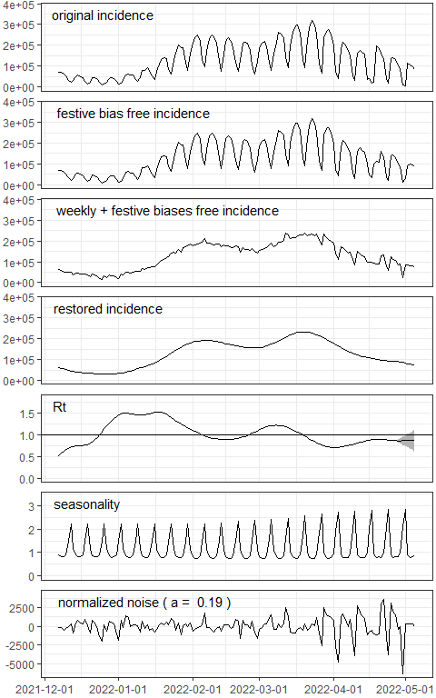

<!-- README.md is generated from README.Rmd. Please edit that file -->

# EpiInvert

<!-- badges: start -->
<!-- badges: end -->

EpiInvert estimates a time varying epidemic reproduction number and a
restored incidence curve by inverting a renewal equation through a
variational model as described in [PNAS,
2021](https://www.pnas.org/doi/10.1073/pnas.2105112118) and [Biology,
2022](https://www.mdpi.com/2079-7737/11/4/540). EpiInvert also corrects
the administrative weekly bias in the daily registration of cases and
the bias introduced by the festive days.

## Installation

You can install the development version of EpiInvert from
[GitHub](https://github.com/) with:

``` r
 install.packages("devtools")
 devtools::install_github("lalvarezmat/EpiInvert")
```

## Example

We attach some required package

``` r
library(EpiInvert)
library(ggplot2)
library(dplyr)
library(grid)
```

We load data on COVID-19 daily incidence up to 2022-05-05 for
[France](https://www.santepubliquefrance.fr/dossiers/coronavirus-covid-19/coronavirus-chiffres-cles-et-evolution-de-la-covid-19-en-france-et-dans-le-monde),
[Germany](https://experience.arcgis.com/experience/478220a4c454480e823b17327b2bf1d4),
[the USA](https://ourworldindata.org/coronavirus-source-data) and
[UK](https://ourworldindata.org/coronavirus-source-data):

``` r
data(incidence)
tail(incidence)
#>           date   FRA    DEU    USA    UK
#> 830 2022-04-30 49482  11718  23349     0
#> 831 2022-05-01 36726   4032  16153     0
#> 832 2022-05-02  8737 113522  81644    32
#> 833 2022-05-03 67017 106631  61743 35518
#> 834 2022-05-04 47925  96167 114308 16924
#> 835 2022-05-05 44225  85073  72158 12460
```

We load some festive days for the same countries:

``` r
data(festives)
head(festives)
#>          USA        DEU        FRA         UK
#> 1 2020-01-01 2020-01-01 2020-01-01 2020-01-01
#> 2 2020-01-20 2020-04-10 2020-04-10 2020-04-10
#> 3 2020-02-17 2020-04-13 2020-04-13 2020-04-13
#> 4 2020-05-25 2020-05-01 2020-05-01 2020-05-08
#> 5 2020-06-21 2020-05-21 2020-05-08 2020-05-25
#> 6 2020-07-03 2020-06-01 2020-05-21 2020-06-21
```

We execute EpiInvert using Germany data:

``` r
res <- EpiInvert(incidence$DEU,"2022-05-05",festives$DEU)
```

We plot the results:

``` r
EpiInvert_plot(res)
```


The main outcomes of EpiInvert, illustrated in this figure, are :


")

------------------------------------------------------------------------

:")

The registration of daily cases is biased in the festive days. We
correct this bias modifying the original incidence values in the festive
days and the next 2 days.

------------------------------------------------------------------------

:")

We use 7-day quasi-periodic multiplicative factors to correct the
administrative weekly bias in the registration of daily cases.

------------------------------------------------------------------------

:")

We compute a restored incidence curve by application of the renewal
equation

------------------------------------------------------------------------

:")

Time varying reproduction number computed using the variational model.
To calculate Rt on each day t, EpiInvert uses the past days (t’\<=t) and
the future days (t’\>t) when available. Therefore, the EpiInvert
estimate of Rt varies when there are more days available. In the above
plot of Rt we show an empiric 95% confidence interval of the expected
variation of Rt as a function of the number of days after t available.

------------------------------------------------------------------------

:")

7-day quasi-periodic multiplicative factors to correct the
administrative weekly bias in the registration of daily cases.

------------------------------------------------------------------------

^a}):")

We compute the difference between the bias corrected incidence curve and
its expected value using the renewal equation normalized by a power of
the incidence.
